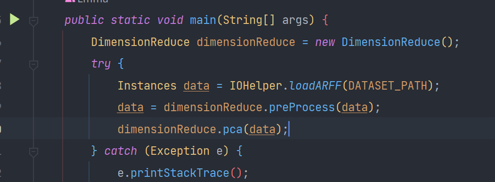
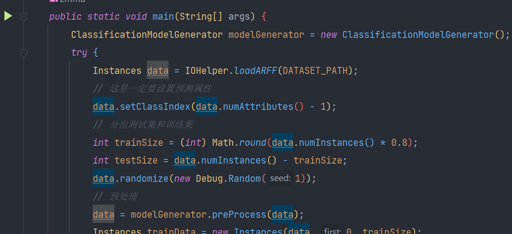
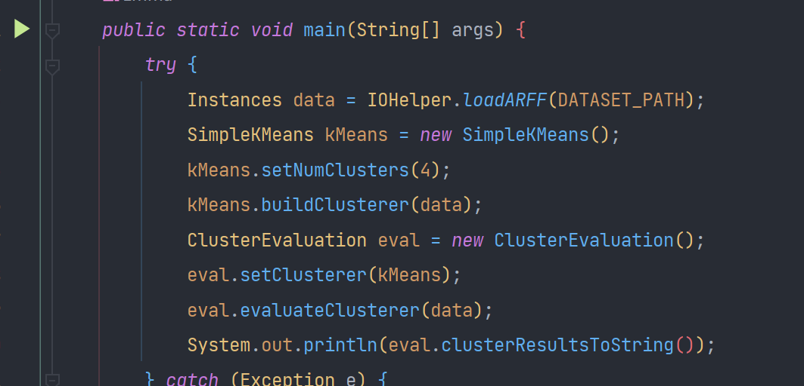

# 大数据分析第3~5次作业源代码
## 1. 代码结构
```aidl
├─.idea
│  ├─codeStyles
│  └─ZeppelinRemoteNotebooks
├─src
│  ├─main
│  │  ├─java
│  │  │  └─nju
│  │  │      └─swi
│  │  │          └─Bobbyhan
│  │  │              ├─ClassificationDemo // 分类代码
│  │  │              ├─ClusterDemo // 聚类代码
│  │  │              ├─DimensionReduceDemo // 降维代码
│  │  │              └─Utils // 工具
│  │  └─resources
│  │      ├─classification // 分类数据集和结果
│  │      │  ├─dataset
│  │      │  └─trainModel
│  │      ├─cluster // 聚类数据集
│  │      │  └─dataset
│  │      └─dimension_reduce // 降维数据集
│  │          ├─dataset
│  │          └─result
│  └─test
│      └─java
```
## 2. 运行方式
### 2.1 降维代码
直接运行`DimensionReduce.java`中的`main`方法，输出结果保存在`src/main/resources/dimension_reduce/result/`中。

### 2.2 分类代码
直接运行`Classification.java`中的`main`方法，其中模型训练的结果保存在`src/main/resources/classification/trainModel/model.bin`中。

### 2.3 聚类代码
直接运行`Cluster.java`中的`main`方法，结果在控制台打印。

